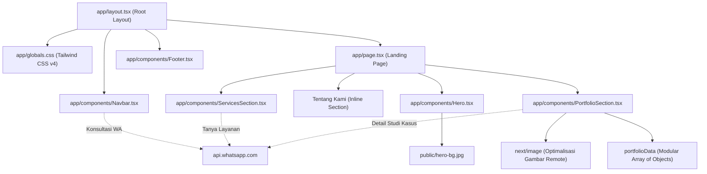

# 🏢 GrowthLine Consulting — Aplikasi Web Company Profile

Aplikasi web profil perusahaan modern, berkinerja tinggi, dan responsif yang dibangun menggunakan **Next.js 16 (App Router)**, **React 19**, **Tailwind CSS v4**, dan **TypeScript**.

---

## 🚀 Memulai (Getting Started)

### Prasyarat (Prerequisites)
- **Node.js**: versi `v18.17.0` atau yang lebih baru
- **npm** / **yarn** / **pnpm** / **bun**

### Instalasi & Pengembangan Local

1. **Clone Repository & Masuk ke Direktori Proyek**
   ```bash
   git clone <repository-url>
   cd company-profile
   ```

2. **Instal Dependensi Proyek**
   ```bash
   npm install
   ```

3. **Jalankan Development Server**
   ```bash
   npm run dev
   ```
   Buka [http://localhost:3000](http://localhost:3000) pada browser Anda untuk melihat hasilnya.

4. **Kompilasi Proyek untuk Produksi (Production Build)**
   ```bash
   npm run build
   npm run start
   ```

---

## 📂 1. Pemetaan Struktur & Hirarki Folder

Berikut adalah pemetaan hirarki folder dan file arsitektur pada proyek ini:

```text
company-profile/
├── 📁 app/                       # Direktori utama Next.js App Router (Routing & Halaman)
│   ├── 📁 components/            # Modul komponen UI modular yang dapat digunakan kembali
│   │   ├── 📄 Navbar.tsx         # Komponen navigasi utama dengan integrasi CTA WhatsApp
│   │   ├── 📄 Hero.tsx           # Banner utama (Hero section) dengan statistik dinamis
│   │   ├── 📄 ServicesSection.tsx# Komponen layanan bisnis dengan kartu interaktif
│   │   ├── 📄 PortfolioSection.tsx# Studi kasus portofolio dengan Next.js Image & pagination 3-item
│   │   └── 📄 Footer.tsx         # Catatan kaki halaman dengan link navigasi & info kontak
│   ├── 📄 favicon.ico            # Ikon favicon browser proyek
│   ├── 📄 globals.css            # Pengaturan CSS global & konfigurasi Tailwind CSS v4
│   ├── 📄 layout.tsx             # Root layout utama (HTML/Body/Navbar/Footer)
│   └── 📄 page.tsx               # Halaman landing page utama (Route: "/")
├── 📁 public/                    # Direktori penyimpan asset statis (Gambar & SVG)
│   ├── 📄 hero-bg.jpg            # Asset gambar latar belakang untuk Hero section
│   └── 📄 *.svg                  # Asset vektor (next.svg, vercel.svg, globe.svg, dll.)
├── 📄 eslint.config.mjs          # Konfigurasi aturan kualitas kode ESLint
├── 📄 next.config.ts             # Konfigurasi server Next.js (Remote pattern gambar eksternal)
├── 📄 package.json               # Dependensi, perintah script, dan metadata proyek
├── 📄 postcss.config.mjs         # Konfigurasi PostCSS untuk kompilasi Tailwind CSS v4
├── 📄 tsconfig.json              # Pengaturan kompilator TypeScript & path alias
└── 📄 README.md                  # Dokumentasi resmi proyek
```

### Deskripsi Fungsi Folder & File Utama
- **`app/`**: Direktori inti aplikasi berbasis Next.js App Router. File `page.tsx` di dalam folder ini secara otomatis dipetakan sebagai rute halaman URL.
- **`app/components/`**: Berisi komponen-komponen UI yang terisolasi dan mandiri untuk menjaga kode halaman utama tetap bersih, deklaratif, dan mudah dirawat (*maintainable*).
- **`public/`**: Menyimpan asset statis yang disajikan secara langsung oleh web server Next.js tanpa beban proses *bundling* JavaScript di sisi klien.
- **`app/globals.css`**: Mendefinisikan variabel gaya global serta mengimpor modul Tailwind CSS v4 (`@import "tailwindcss";`).
- **`app/layout.tsx`**: Pembungkus tingkat teratas (*Root Layout*) yang menyediakan elemen global seperti `Navbar` dan `Footer` secara konsisten di seluruh rute.

---

## ⚙️ 2. File Konfigurasi Root

| File Konfigurasi | Fungsi & Peran Arsitektur |
| :--- | :--- |
| **`package.json`** | Menyimpan daftar dependensi proyek (Next.js 16, React 19, Tailwind CSS v4, FontAwesome, Lucide), versi paket, dan perintah *script* (`dev`, `build`, `start`, `lint`). |
| **`next.config.ts`** | Pengaturan server tingkat lanjut Next.js. Mengatur `images.remotePatterns` agar `next/image` dapat mengabtraksi dan mengoptimalkan gambar eksternal (misal: Unsplash) secara aman. |
| **`tsconfig.json`** | Mengatur aturan kompilator TypeScript, pemeriksaan tipe ketat (*strict checking*), dan *path alias* (seperti `@/*` yang merujuk ke direktori root). |
| **`postcss.config.mjs`** | Mengonfigurasi *plugin* PostCSS, mengintegrasikan `@tailwindcss/postcss` untuk mentransformasi utilitas Tailwind CSS v4 menjadi CSS murni. |
| **`eslint.config.mjs`** | Memastikan standar penulisan kode TypeScript/React terjaga dan mematuhi konvensi *best practice* Next.js. |
| **`.gitignore`** | Menentukan file dan folder yang diabaikan oleh kontrol versi Git (seperti `node_modules/`, `.next/`, dan file *log*). |

---

## 🔄 3. Alur Arsitektur & Hubungan Antar Komponen

### Diagram Alur Arsitektur (Architecture Flow)



### Penjelasan Interaksi Komponen

1. **Titik Masuk & Pembungkus Layout**: Saat mengakses rute `/`, Next.js merender `app/layout.tsx` yang memuat file `app/globals.css`. Layout ini membungkus halaman secara konsisten dengan header `Navbar` dan footer `Footer`.
2. **Komposisi Halaman**: File `app/page.tsx` menyusun hierarki bagian halaman secara urut dan logis: `Hero` ➔ `Tentang Kami` ➔ `ServicesSection` ➔ `PortfolioSection`.
3. **Manajemen Data & Pagination**:
   - `PortfolioSection.tsx` membaca data studi kasus dari struktur data modular `portfolioData`.
   - Dilengkapi fitur **Filter Kategori Interaktif** serta **Sistem Pagination 3 Item per Halaman** (`ITEMS_PER_PAGE = 3`).
   - Menggunakan `<Image />` bawaan Next.js dengan `fill` dan `object-cover` untuk pemuatan gambar yang cepat tanpa pergeseran tata letak (*layout shift*).
4. **Integrasi WhatsApp**: Komponen `Navbar.tsx`, `ServicesSection.tsx`, dan `PortfolioSection.tsx` terhubung secara otomatis ke link Whatsapp untuk konsultasi langsung.

---

## 🛠️ Fitur Utama Aplikasi

- 📱 **100% Responsif (Mobile, Tablet, Desktop)**: Didesain presisi menggunakan Tailwind CSS Grid (`grid-cols-1 md:grid-cols-2 lg:grid-cols-3`).
- ⚡ **Optimalisasi Gambar Next.js**: Pemuatan cepat gambar resolusi tinggi menggunakan `next/image` dengan properti `fill` dan `object-cover`.
- 🏷️ **Badge Kapsul (Pill Design)**: Desain label berbentuk kapsul (`rounded-full`) untuk kategori studi kasus dan metadata klien.
- 📄 **Pagination Interaktif 3-Item**: Transisi halaman yang mulus dilengkapi indikator angka aktif, navigasi *Sebelumnya/Selanjutnya*, dan fungsi *scroll-to-grid*.
- 🎨 **Estetika Visual Modern**: Sentuhan *glassmorphism*, bayangan halus (`shadow-sm` / `shadow-xl`), border tipis, serta efek hover interaktif.

---

## 💡 Checklist Praktik Terbaik (Best Practices)

- ✅ **Pemisahan Komponen Modular**: Logika UI terpisah dengan rapi ke dalam komponen yang reusabel.
- ✅ **Interface TypeScript Ketat**: Struktur data bertipe jelas (`PortfolioItem`, `ServiceItem`).
- 💡 **Pemisahan Layer Data (Rekomendasi)**: Untuk pengembangan jangka panjang, array data statis dapat dipindahkan ke folder khusus `app/data/` (seperti `app/data/portfolioData.ts`).
- 💡 **Penggunaan Struktur `src/` (Opsional)**: Dapat diterapkan jika proyek berkembang menjadi *multi-package/monorepo* untuk memisahkan kode aplikasi dari file konfigurasi root.

---

*Dikelola oleh Tim Pengembang Frontend & Arsitektur Perangkat Lunak.*
